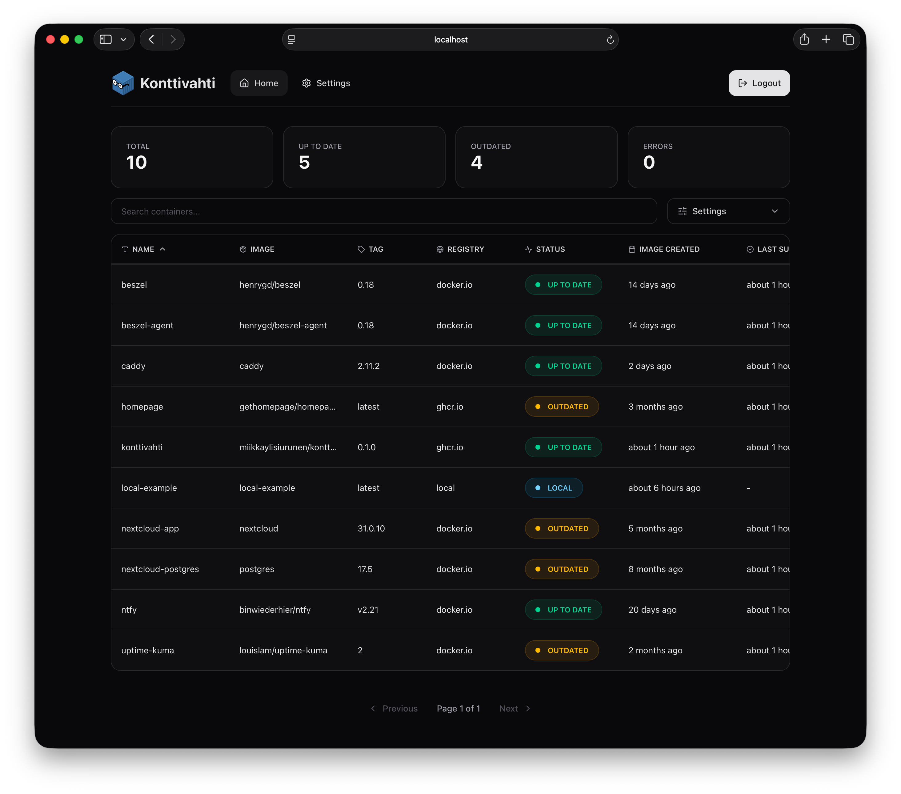

# Konttivahti <!-- omit from toc -->

Konttivahti is a self-hosted Docker image monitoring service. It automatically discovers running containers from your Docker host, checks whether newer versions are available, presents the results in a dashboard, and can notify you when updates are available.



## Table of Contents <!-- omit from toc -->

- [Features](#features)
- [Usage](#usage)
  - [1. Create `docker-compose.yml`](#1-create-docker-composeyml)
  - [2. Start the service](#2-start-the-service)
  - [3. Complete first-time setup](#3-complete-first-time-setup)
- [Scanning for updates](#scanning-for-updates)
- [Configuration](#configuration)
  - [Scan schedule](#scan-schedule)
  - [Ignoring containers](#ignoring-containers)
  - [Tracking against a specific tag](#tracking-against-a-specific-tag)
  - [Docker host](#docker-host)
  - [Session lifetime](#session-lifetime)

## Features

- Auto-detects running containers from the Docker socket.
- Notification integration via [Shoutrrr](https://github.com/containrrr/shoutrrr).
- Supports checking updates against a specific tag.
- Supports ignoring containers via a configurable container label.
- Runs as a single Dockerized service.

## Usage

### 1. Create `docker-compose.yml`

```yaml
services:
  konttivahti:
    image: ghcr.io/miikkaylisiurunen/konttivahti
    container_name: konttivahti
    restart: unless-stopped
    ports:
      - '3000:3000'
    volumes:
      - ./data:/data
      - /var/run/docker.sock:/var/run/docker.sock:ro
```

If you prefer not to mount the Docker socket directly, you can use a Docker socket proxy. Here's an example that uses the [tecnativa/docker-socket-proxy](https://github.com/tecnativa/docker-socket-proxy) image to expose only the minimal permissions needed for Konttivahti:

```yaml
services:
  konttivahti:
    image: ghcr.io/miikkaylisiurunen/konttivahti
    container_name: konttivahti
    restart: unless-stopped
    ports:
      - '3000:3000'
    volumes:
      - ./data:/data
    environment:
      DOCKER_HOST: tcp://docker-socket-proxy:2375
    depends_on:
      - docker-socket-proxy

  docker-socket-proxy:
    image: tecnativa/docker-socket-proxy
    restart: unless-stopped
    volumes:
      - /var/run/docker.sock:/var/run/docker.sock:ro
    environment:
      CONTAINERS: 1
      IMAGES: 1
```

### 2. Start the service

```bash
docker compose up -d
```

### 3. Complete first-time setup

Open `http://localhost:3000` and create the admin account.

## Scanning for updates

Konttivahti automatically discovers running containers from the Docker host. By default, each container is checked against the `latest` tag for its image. Containers can also define a specific tag to track when `latest` is not the tag you want to compare against. See [Tracking against a specific tag](#tracking-against-a-specific-tag) for configuration details.

Update checks run on the schedule defined by the `SCAN_SCHEDULE` environment variable (default: every 6 hours). New running containers appear in the dashboard immediately. Their update status is automatically refreshed during scheduled scans. You can also start a scan manually from the dashboard at any time.

## Configuration

### Scan schedule

Environment variable: `SCAN_SCHEDULE`  
Default: `0 */6 * * *`

Controls how often Konttivahti scans tracked containers for available image updates. The value must be a standard cron expression. The default runs every six hours, which is a sensible balance for most environments. Running scans too frequently can increase load on image registries and may hit rate limits, especially when monitoring many containers.

### Ignoring containers

Environment variable: `IGNORE_CONTAINER_LABEL`  
Default: `konttivahti.ignore`

Defines the label key Konttivahti checks to determine whether a container should be excluded from discovery results and update scanning. This is useful for infrastructure or helper containers you do not want tracked. Any truthy value on this label will mark the container as ignored.

To ignore specific containers from scans and status display, add the label defined by `IGNORE_CONTAINER_LABEL` to the container with a truthy value. For example:

```yaml
services:
  nginx:
    image: nginx
    labels:
      konttivahti.ignore: 'true'
```

### Tracking against a specific tag

Environment variable: `TRACK_TAG_LABEL`  
Default: `konttivahti.track-tag`

Defines the label key Konttivahti checks to determine which registry tag should be used as the update target for a container.

Konttivahti checks containers against `latest` by default. This works well for images where `latest` is the tag you normally update to. For images where you need to stay on a specific version, `latest` may not be useful. For example, if a service must stay on PostgreSQL 16, `latest` might point to PostgreSQL 18, which is not an update you can apply. In that case, you can track the `16` tag instead.

```yaml
services:
  postgres:
    image: postgres:16.4
    labels:
      konttivahti.track-tag: '16'
```

### Docker host

Environment variable: `DOCKER_HOST`  
Default: unset

Sets the Docker API endpoint. Leave it unset to use the default mounted Docker socket at `/var/run/docker.sock`, or set it to a TCP endpoint such as `tcp://docker-socket-proxy:2375` when using a Docker socket proxy.

### Session lifetime

Environment variable: `SESSION_TIMEOUT_MS`  
Default: `604800000`

Sets how long an authenticated user session remains valid, in milliseconds. The default is 7 days. Expiry is sliding rather than fixed, so active use extends the session lifetime.
